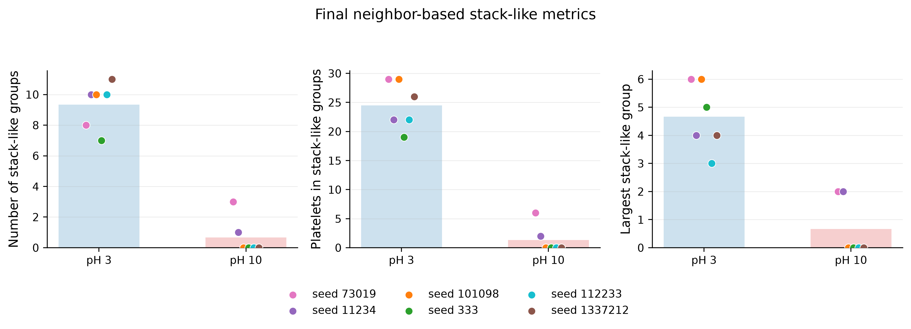

# Clay platelet simulation and structural analysis

Ivan Lisovskyi · BSc thesis project · C++, MercuryDPM, PVFMM, Python

For my bachelor's thesis, I studied how small clay-like platelets arrange themselves in a simulation. I extended an existing MercuryDPM driver and compared two prescribed interaction patterns labelled pH 3 and pH 10. I then used Python to look at energy changes, platelet orientation and local groups of platelets across repeated runs.

The labels describe simplified model inputs. They do not mean that the simulation reproduces the full chemistry of clay in water.



## My part of the project

I started from the upstream `Clay.cpp` driver. MercuryDPM, its Clump extension and PVFMM already provide the simulation engine, contact handling, time integration, rigid clumps and long-range solver. My work was to extend that setup and analyse what it produced:

- Added source values for the silica-like face, alumina-like face and platelet edge, with pH 3 and pH 10 endpoints and interpolation between them.
- Subtracted the mean source value for the periodic calculation and used the corrected values consistently in the solver and visualisation output.
- Corrected the potential-energy calculation so it used the same periodic or free-space boundary choice as the force calculation.
- Added outputs for platelet normals and measures of orientational order, including the orientation tensor, its largest eigenvalue and a scalar order parameter.
- Compared runs with matched random seeds, checked the grouping thresholds and measured initial particle overlaps using Python.
- Worked with a MercuryDPM/PVFMM build using MPI and OpenMP on macOS, and inspected the 3-D output in ParaView.

An important part of the analysis was separating overall alignment from local grouping. Two runs can have similar global orientation measures while showing different local structures. That is why I included both types of measurement.

## Try a small example

The source-template plot can be generated without running a simulation or downloading the large raw results. From this folder, using Python 3.10 or later:

```bash
python3 -m venv .venv
source .venv/bin/activate
python -m pip install -r scripts/requirements.txt
python scripts/plot_charge_templates.py --out-dir generated
```

On Windows, activate the environment with `.venv\Scripts\activate` instead.

This creates PNG, PDF and SVG files named `charge_template_raw_and_corrected_vs_ph` in `generated/`. The plot shows the prescribed source values before and after their mean is subtracted for the periodic solver. It explains one part of the model; it does not reproduce the full thesis study or validate clay chemistry.

This command was checked with Python 3.12 and Matplotlib 3.10.9 when the repository was prepared. The full C++ build and simulations were not rerun.

## What the saved runs showed

The study compared 50-clump runs for the two templates, using six matched seeds each: `73019`, `11234`, `101098`, `333`, `112233` and `1337212`. The tables and figures here are saved thesis results from those 12 runs.

Global orientational order did not show a clear, consistent separation. Mean `S_tensor` was about 0.694 for pH 3 and 0.678 for pH 10, with substantial variation between seeds.

Local grouping showed a larger difference under the chosen rule: on average, 24.5 platelets belonged to stack-like groups for pH 3, compared with 1.33 for pH 10. This is a result for this small simulated dataset, not a general conclusion about real clay.

The grouping rule links platelets when their minimum-image centre distance is `< 0.08` and the angle between their unoriented normals is `≤ 20°`. Connected platelets then form a group. This measures nearby, similarly oriented platelets; it does **not** prove that they are in face-to-face contact. The [threshold-sensitivity table](figures/six_seed_clean/stacking_sensitivity_six_seed_summary.csv) shows how other choices affect the count.

See the [orientation plot](figures/six_seed_clean/03_orientation_metrics_six_seeds.png), [energy-change plot](figures/six_seed_clean/01_energy_change_six_seeds.png), [per-run final values](figures/six_seed_clean/final_values_six_seed_summary.csv) and [means](figures/six_seed_clean/six_seed_means.txt).

### What to keep in mind

The pH-labelled source strengths are simplified inputs, not experimentally calibrated surface charge densities. Contact friction parameters were not set, so the analysed contact response is frictionless and normal-only.

Long-range energy includes a within-clump baseline that differs between templates. I therefore compared changes from each run's first saved state, rather than treating absolute total energies as thermodynamic free energies. Initial overlaps were also allowed and checked; the [overlap summary](figures/six_seed_clean/initial_overlap_summary.csv) records that limitation.

More calibration and validation would be needed before using this model to make predictions about real kaolinite.

## Building the C++ driver

`src/clay_anisotropy_updated.cpp` is not a standalone program. It needs a compatible MercuryDPM source checkout with the Clump headers, PVFMM integration, MPI and an OpenMP-capable compiler. Those dependencies are not included here.

Copy the driver into `Drivers/LongRange/Clay/` in that checkout. If a file with the same name already exists, preserve it first. The inspected upstream CMake setup creates a target for each `.cpp` filename in that directory, links `Chute` and `pvfmmStatic`, and adds the PVFMM include paths. The expected target is `clay_anisotropy_updated`. Reconfigure the upstream build after adding the driver.

A configuration outline from the upstream source root is:

```bash
cmake -S . -B build \
  -DMercuryDPM_PVFMM=ON \
  -DMercuryDPM_USE_MPI=ON \
  -DMercuryDPM_USE_OpenMP=ON
cmake --build build --target clay_anisotropy_updated
```

Compiler selection and dependency paths may need to be set for your machine. The original macOS setup used Homebrew GCC 15, not Apple Clang. The driver assumes periodic PVFMM boundaries and is incompatible with a build using `PVFMM_EXTENDED_BC`. Exact dependency revisions are not recorded here, so these commands are a starting point rather than a complete reproducible build recipe.

The executable accepts positional arguments:

```text
clay_anisotropy_updated <pH> <insertion-attempt count> <simulation time> <seed>
```

Defaults in the source are pH 8, 50 insertion attempts, simulation time 0.2 and seed 1. The saved comparison used pH 3/10 and a simulated duration of 1. Check the output for the number of clumps actually inserted. Other settings, including the `1e-6` timestep, long-range scaling and output cadence, are in the driver.

**Run each simulation in its own new, empty output directory.** The driver calls `removeOldFiles()` before solving, so running it in an existing results folder can remove or replace earlier files. The original 50-clump runs produced hundreds of VTU/VTP files and several gigabytes of data per run.

## Running the full analysis

The four Python scripts are unchanged. Three read the raw run files from folders under `Path.home() / "MercuryRuns"` with this layout:

```text
MercuryRuns/
  ph3_anisotropy_updated_clean_N50_1s_seed73019/
  ph10_anisotropy_updated_clean_N50_1s_seed73019/
  ...same two cases for the other five seeds...
```

The inputs include `LRPotential.txt`, `AnisotropyLog.csv`, `clay_anisotropy_updated.ene`, `clay_anisotropy_updated_normals_*.vtp` and the relevant particle `.vtu` files. The large raw files are not in this repository, and the summary CSVs cannot be used in their place.

To use a different data location, edit `run_folder()` or `RUNS_BASE` / `RUN_BASE` in a working copy of the relevant script. There is no raw-data-path command-line option.

| Script | Purpose and output |
|---|---|
| `plot_charge_templates.py` | Draws the template plot without raw runs; use `--out-dir generated` |
| `plot_ph3_ph10_six_seed_clean.py` | Reads all 12 runs and creates figures and tables; use `--out-dir generated/six_seed` to preserve saved results |
| `stacking_analysis.py` | Examines final geometric groups and writes `figures/stacking_summary.csv` |
| `initial_overlap_check.py` | Checks six initial particle files and writes `figures/six_seed_clean/initial_overlap_summary.csv` |

The overlap script's default output would overwrite the summary included here. Change its `OUT_CSV` or run it in a disposable copy. Keep new analysis output separate from the saved thesis results.

## Contents and possible improvements

This folder contains one C++ driver, four Python scripts, their dependency list, five CSV summaries, one text summary and three PNG figures. Compiled programs, raw simulations, the full upstream repository, articles and the thesis PDF are left out.

Useful next steps would be a recorded build environment, small tests of the geometry calculations, more seeds and grouping-threshold checks, and comparison with physical data. When changing the code, preserve the upstream credit, record settings and seeds, and save new results separately.

## Credit and permissions

The driver's original MercuryDPM copyright notice is preserved, and the [upstream licence](LICENSE-MercuryDPM.txt) is included unchanged. It is not a blanket licence for all thesis material or dependencies. Keep this package private until the relevant thesis and publication permissions have been checked.

The thesis declared help from ChatGPT, Claude, Grammarly and DeepL with environment setup, explanations, literature searches, code and report review, data-processing scripts and language. I reviewed and edited the final work and am responsible for its interpretation.
