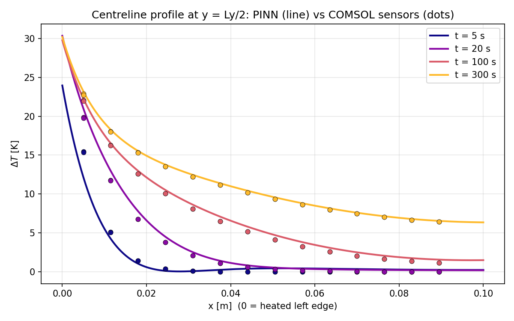

# Inverse heat transfer with a physics-informed neural network

Ivan Lisovskyi · Individual Application of Advanced Technology project · Python, PyTorch

In this project, I used temperature data to estimate how quickly heat spreads through a plate. The unknown quantity is thermal diffusivity, `alpha`. I trained a physics-informed neural network (PINN) to fit the temperatures while also following the heat equation and the plate's boundary conditions.

The model could fit temperatures closely and still give a poor estimate of diffusivity. Comparing runs with different starting values helped show why temperature error alone was not enough to judge the result.



## My work

I worked on the PINN notebook, training setup, validation and analysis. The model uses PyTorch and Fourier input features. Diffusivity is represented as `alpha = exp(log_alpha)` to keep it positive, and automatic differentiation supplies the derivatives for the heat equation and boundary conditions.

Training has two stages: first fitting the temperature field with diffusivity fixed, then training the network and diffusivity together. I checked predictions at held-out sensor locations and compared saved runs with different starting values.

The temperatures come from virtual sensors in a COMSOL simulation, not laboratory measurements. The original COMSOL model is not included.

## Results

The selected run's [saved metrics](results/selected-run/metrics.txt) are:

| Quantity | Result |
|---|---:|
| Estimated diffusivity | `1.085367e-5 m²/s` |
| Relative diffusivity error | `8.537%` |
| Held-out-sensor temperature RMSE | `0.395640 K` |

Across the six saved starting-value experiments, diffusivity errors range from about **12.3% to 50.5%**, even though temperature RMSE stays below 1 K. The model therefore did not recover diffusivity reliably across these runs.

This suggests that the parameter is difficult to identify in this setup, but the experiments do not isolate the cause: architecture and random sampling during training also affect the outcome. Validation uses held-out sensors from the same simulated dataset, not an independent experiment.

You can view the [sensor fit](results/selected-run/sensor_fit.png), [temperature contour](results/selected-run/contour_t300.png) and [starting-value comparison](results/selected-run/notebook_alpha_sensitivity_summary.png) without running the code. The contours clip temperature rise to `0–30 K`, so they should not be used on their own to judge full-field accuracy.

These are saved project results, not a fresh training run. Exact package versions were not recorded, and the current notebook may not reproduce every saved value exactly.

## Run the notebook

Use Python 3.10 or later. From this folder:

```bash
python3 -m venv .venv
source .venv/bin/activate
python -m pip install -r requirements.txt
python prepare_data.py
jupyter lab final_notebook.ipynb
```

On Windows, activate with `.venv\Scripts\activate` instead.

`prepare_data.py` checks and unpacks the complete dataset into `sensors_T.csv` (about 15.5 MB). It uses only the standard library and will not overwrite a different CSV with that name. To check the compressed data without installing packages or writing files, run `python3 prepare_data.py --check-only`.

In Jupyter, select the new environment's Python kernel and use this project folder as the working directory. Sections 1–5 define the model and helpers. **Section 6 starts training:** 2,000 epochs with fixed diffusivity, then 6,000 with trainable diffusivity. This is not a short demo run.

The notebook uses Apple MPS when available and otherwise the CPU; it does not choose CUDA automatically. Set `DEVICE = "cpu"` in the constants cell to force CPU use.

New results go to `outputs_submission/`, separate from the saved examples. See [model, data and run settings](docs/MODEL_AND_DATA.md) for the equations, validation split, configuration and output files.

## Checks and further work

Dataset and packaging checks used Python 3.12.14; the original notebook records Python 3.10.19. A clean dependency installation and full training run have not been repeated for this copy.

I would next compare repeated runs in a recorded environment, then test different sensor positions, heating conditions and an independent synthetic dataset. Both temperature error and diffusivity error need to be compared.

Academic references are in the [notebook](final_notebook.ipynb). Data provenance, publication permissions and changes made when preparing the repository are recorded in the [project notes](../docs/PROJECT_NOTES.md).
